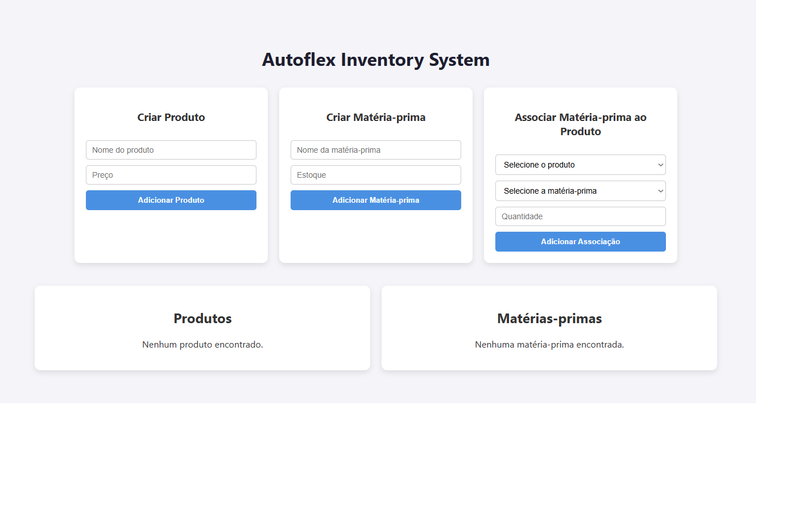

# 🌟 Autoflex Inventory System - Frontend

[](https://reactjs.org/)
[](https://tailwindcss.com/)
[](https://vitejs.dev/)
[](LICENSE)

Frontend do **Autoflex Inventory System**, desenvolvido para interagir com o backend e gerenciar produtos, matérias-primas e suas associações.

---

## 📌 Funcionalidades

- Listagem, criação, edição e exclusão de produtos  
- Listagem, criação, edição e exclusão de matérias-primas  
- Associação de matérias-primas a produtos  
- Formulários com validação de dados  
- Integração completa com a API backend  

---

## 🛠 Tecnologias Utilizadas

- **React 18** – Biblioteca principal de UI  
- **TailwindCSS** – Framework CSS para estilo  
- **Axios** – Consumo da API backend  
- **Vite** – Bundler e dev server  
- **React Router** – Navegação entre páginas  

---

## 🗂 Estrutura do Projeto
frontend/
├── public/
├── src/
│ ├── assets/
│ ├── components/
│ ├── pages/
│ ├── services/ # API calls
│ ├── App.jsx
│ └── main.jsx
├── package.json
├── tailwind.config.js
└── README.md

## ▶️ Como Executar

1. Instalar dependências:
```bash
npm install

Iniciar servidor de desenvolvimento:

npm run dev

Abrir no navegador:

http://localhost:5173

⚠️ Certifique-se de que o backend esteja rodando em http://127.0.0.1:8000 para integração completa.

🔗 Principais Funcionalidades e Rotas

/products – Listagem de produtos

/products/new – Criar novo produto

/products/:id/edit – Editar produto

/raw-materials – Listagem de matérias-primas

/raw-materials/new – Criar nova matéria-prima

/raw-materials/:id/edit – Editar matéria-prima

/associations – Visualizar e gerenciar associações Produto ↔ Matéria-Prima

📸 Imagens / Layout

Adicione 

📝 Registro de Progresso

Estrutura Inicial: criação do projeto com Vite + React

Configuração de Estilo: TailwindCSS integrado

Componentes Básicos: header, sidebar, layout principal

CRUD Produtos: listagem, criação, edição, exclusão

CRUD Matérias-Primas: listagem, criação, edição, exclusão

Associação Produto x Matéria-Prima: integração com backend

Validação e UX: formulários validados, mensagens de erro